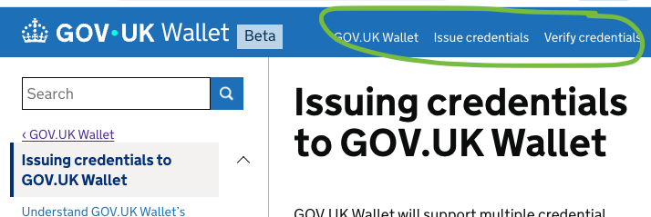
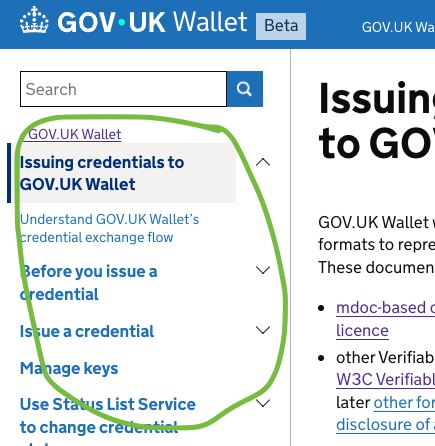

# GOV.UK Wallet technical documentation
This documentation is for government services that want to integrate with GOV.UK Wallet.


The Wallet technical documentation is based on the [Tech Docs Template](https://github.com/alphagov/tech-docs-template) - a [Middleman template](https://github.com/alphagov/tech-docs-template#:~:text=Template%20is%20a-,Middleman%20template,-that%20you%20can) to build technical documentation using a GOV.UK style.

## Preview the documentation in a browser

To preview any changes and additions you have made to the documentation in a browser, clone this repo and use the [Dockerfile in this repo](Dockerfile) to run a Middleman server on your machine without having to set up Ruby locally.

This setup has `live reload` enabled, which means your changes will be applied as you edit files in the source directory. The only exception to this is if you make changes to `config/tech-docs.yml`, you must stop and restart the server to see your changes in the preview. You can stop the server with `Ctrl-C`.

Run the [helper script](preview-with-docker.sh):

```bash
./preview-with-docker.sh
```

It may take a few minutes to build the docker container, particularly if it is your first time running the script. When the server has finished loading you should then see the following output in the terminal:

```bash
== View your site at "http://localhost:4567", "http://127.0.0.1:4567"
```

## Managing content

To add or change existing content, edit the markdown in the `.html.md.erb` files in the `source` folder.  If you add a new folder, remember to add in `index.html.md.rb` file.  This is used by the tech docs `gem` to build the site correctly.  If this is not included you may not be able to generate the site.

> Always ensure you have checked that new content build correctly by running [`preview-with-docker.sh`](#preview-the-documentation-in-a-browser).

If you do not want the `index.html.md.rb` to be included in the [table of contents (ToC)](#table-of-contents) you can hide it from navigation by adding the following to the top of the page:

```diff
---
title: Issuing credentials to GOV.UK Wallet
weight: 1
last_reviewed_on: 2025-11-27
review_in: 6 months
- ---
+ hide_in_navigation: true
+ ---
```

If you move pages around and URLs change, make sure you set up redirects from the old URLs to the new URLs.  You can do this in `config/tech-docs.yml` like so:

```diff

show_contribution_banner: false
github_repo: your/git/repo
github_branch: main

+  redirects:
+    /original-path/index.html: /new/path/
+    /original-path-2/index.html: /new/path/2/
  
api_path: ./openapi/cri.yaml

```

> including the `/` at the end of the redirect helps the tech docs to expand the ToC correctly.  If you don't need this leave it off.


## Managing navigation

### Header links

The header links are found in the top right of the page, for example:



The header links can be used to group large sections of content together, to help guide the user to specific areas of the site. These are managed in the `config/tech-docs.yml` under `header_links`.  For example:

```yaml

# Links to show on right-hand-side of header
header_links:
  Homepage: /
  Jams and spreads: /jams/
  Meats and cheeses: /meats/

```


### Table of contents (ToC)

The ToC is found on the left of the main content, for example:



The ToC contains links to pages and headings of content throughout the site.  When the site is built the `source` directory is scanned by the tech docs gem, and this generates the ToC.  As the ToC is generated from the Markdown headings ( `# h1, ##h2`... etc) the ToC can become large and difficult to navigate.  There are some settings available to help you manage the ToC:

#### Config settings

in `config/tech-docs.yml` you can control:

- multipage navigation using `multipage_nav: true`
- collapsible navigation using `collapsible_nav: true`
- how many levels to include in the table of contents `max_toc_heading_level: 2`

For more information about these read the comments in `config/tech-docs.yml` or look at the tech docs format README.

>  Or for more fun, why not take half an hour and play around.  See what happens when you create pages and change the settings.

If you make changes to the config you will need to stop and re-start your docker preview to see these take effect

#### Page settings

Each page contains a code block before the main content, for example:
```
---
title: Issuing credentials to GOV.UK Wallet
last_reviewed_on: 2025-11-27
review_in: 6 months
```

To help manage your ToC you can use:

- `hide_in_navigation: true` to include or exclude the page from the ToC
- `weight: 1` to control the order

### Layouts

You can make use of layouts to help you better structure your pages.  Layouts will allow you to group content together, particularly when used with the [toc](#table-of-contents-toc) and [header link](#header-links) above.  Using layouts you can create sections of the site with their own ToC, which can be reached by the header links. 

#### Making a layout

To create a new layout first make a file called `{your_layout_name}.html.erb` in the `source/layouts` directory.  

| Name            | Description                                                                                      | Example                |
|-----------------|--------------------------------------------------------------------------------------------------|------------------------| 
| `unique_name`   | This is just a placeholder variable.  It can be whatever you lke, but should explain the layout. | `support_pages`        |
| `directory`     | The path to the `index.html.md.rb` file in your source folder.  Do not include `source`.         | `contact/support.html` |
| `backlink`      | The text to display in the link above the ToC.                                                   | `Overview`             |
| `backlink_path` | The url path to return back to.                                                                  | `/`                    |


Add the following content to your new file:

```

# Collecting all the pages and subpages from the index page provided

<% {unique_name} = sitemap.resources.find {|resource| resource.path == "{directory}" }.children %>

# Creates a backlink above the ToC.  Leave this out if you don't want/need this
<% content_for :sidebar do %>
  <a href='{backlink_path}' class="toc__back-link govuk-link">&lsaquo; {backlink}</a>
  <%= render_page_tree {unique_name}, current_page, config, nil %>
<% end %>

# This creates the ToC and navigation for the section you've defined.
<% wrap_layout :core do %>
  <%= yield %>
  <% content_for(:toc_module, "in-page-navigation") %>
<% end %>

```
Remember to rebuild your site after creating a new layout.


### Using a layout

Once you have a layout, you can apply it to all the pages you want to include by adding it to the codeblock at top of the page:

```diff
---
title: Issuing credentials to GOV.UK Wallet
last_reviewed_on: 2025-11-27
review_in: 6 months
+ layout: {your_layout_name}
```

If you plan to navigate to your subsection using the [header links](#header-links), don't forget set the values to your pages e.g:

```yaml

header_links:
  Homepage: /
  Support: /contact/support

```

#### A note layouts and ToC

## Code of conduct

Please refer to the `alphagov` [code of conduct](https://github.com/alphagov/.github/blob/main/CODE_OF_CONDUCT.md).

## Licence

Unless stated otherwise, the codebase is released under [the MIT License][mit].
This covers both the codebase and any sample code in the documentation.

The documentation is [© Crown copyright][copyright] and available under the terms of the [Open Government 3.0][ogl] licence.

[mit]: LICENCE.md
[copyright]: http://www.nationalarchives.gov.uk/information-management/re-using-public-sector-information/uk-government-licensing-framework/crown-copyright/
[ogl]: http://www.nationalarchives.gov.uk/doc/open-government-licence/version/3/
