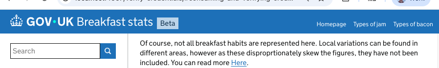

# GOV.UK Wallet technical documentation
This documentation is for government services that want to integrate with GOV.UK Wallet.


The Wallet technical documentation is based on the [Tech Docs Template](https://github.com/alphagov/tech-docs-template) - a [Middleman template](https://github.com/alphagov/tech-docs-template#:~:text=Template%20is%20a-,Middleman%20template,-that%20you%20can) to build technical documentation using a GOV.UK style.

# Preview the documentation in a browser

To preview any changes and additions you have made to the documentation in a browser, clone this repo and use the [Dockerfile in this repo](Dockerfile) to run a Middleman server on your machine without having to set up Ruby locally.

This setup has live reload enabled, which means your changes will be applied as you edit files in the source directory. The only exception to this is if you make changes to `config/tech-docs.yml`, you must stop and restart the server to see your changes in the preview. You can stop the server with `Ctrl-C`.

Run the [helper script](preview-with-docker.sh):

```bash
./preview-with-docker.sh
```

It may take a few minutes to build the docker container, particularly if it is your first time running the script. When the server has finished loading you should then see the following output in the terminal:

```bash
== View your site at "http://localhost:4567", "http://127.0.0.1:4567"
```

## Making changes to content

To add or change content, edit the markdown in the `.html.md.erb` files in the `source` folder.

In order to configure some aspects of layout, like the header, edit `config/tech-docs.yml`.

If you move pages around and URLs change, make sure you set up redirects from the old URLs to the new URLs.

## Using header links to group content

As your site grows you may want to group related content in sections using `header_links`.  These can be set in the `config/tech_docs.yaml` file, for example:

```yaml
header_links:
  Homepage: /
  Types of jam: /jam-types/
  Types of bacon: /bacon-types/
```

Your links will now appear in the navigation bar,and take users to the page you defined above.  The config above would look like this:



If you are using a Table of Contents (ToC) your page headings, and subheadings will appear in the left hand menu.  You can make a specific table of contents for each `header_link`, [using layouts you have defined](#creating-layouts).

Including the `/` at the end of your header link path helps `middleman` to open the ToC at the right section.

Header links can also be used to take users to external sites, these will not appear in your ToC.

### Using layouts to generate table of contents

You can use layouts to tailor the content of page or pages, depending on your user needs.  A common use of layouts is to group sections of related [content into a specific ToC](#using-layouts-to-generate-table-of-contents), especially when [combined with header links](#using-header-links-to-group-content).

Layouts can be used to [alter the layout and content of the site](https://middlemanapp.com/basics/layouts/), however we recommend you confirm any changes from the standard structure with user research, design and accessibility communities before publishing.

To use your an existing layout, add the name of the file to [the frontmatter](https://middlemanapp.com/basics/frontmatter/) in the pages you want to include.  For example:

```diff
    ---
    title: All about the jam making process
    weight: 1
    last_reviewed_on: 1552-01-01
    review_in: 3 months
+   layout: issuer 
    ---
```

####  Example table of contents layout process

To make a layout, create a new file called `your-new-layout.rb` in the `source/layouts` directory.  The example below shows how to use layouts to create a ToC for the `Types of Jam` section.

In this example, you have a tech docs site with the following file structure:

```
source/
├── index.html                   
├── contact.html
├── jam-types/ # this is the link used in the `header_links` href
  └── index.html
       ├── sweet/
           ├── index.html 
           ├── strawberry.html     
           ├── raspberry.html
       ├── savoury/
           ├── index.html 
           ├── chutney.html     
           ├── marmalade.html
├── bacon-types/ # this is the link used in the `header_links` href
  └── index.html
       ├── smokey/
           ├── index.html 
       ├── canadian/
           ├── index.html
├── layouts/
    └── jam_layout.rb # this is the layout you want to use for your jam ToC
```

Inside `jam_layout.rb` you can [use `ruby`](https://www.ruby-lang.org/en/documentation/quickstart/) to apply the layout:

```
<% jam_types_index_page = sitemap.resources.find {|resource| resource.path == "jam-types/index.html" } %>
<% content_for :sidebar do %>
  <a href='/' class="toc__back-link govuk-link">&lsaquo; Breakfast stats</a>
  <%= render_page_tree [jam_types_index_page], current_page, config, yield, include_child_resources: false %>
  <%= render_page_tree jam_types_index_page.children, current_page, config, yield %>
<% end %>

<% wrap_layout :core do %>
  <%= yield %>
  <% content_for(:toc_module, "in-page-navigation") %>
<% end %>
```

In the example above:

- `sitemap.resources` is an array containing [`Middleman resource`](https://www.rubydoc.info/gems/middleman-core/Middleman/Sitemap/Resource) objects, such as pages and images.  In this example we filter through the resources until we find a page with the path `jam-types/index.html`
- `content_for` and `yield`help the Middleman server to understand which part of the page template we want to add our content to
- `render_page_tree` is used by the [`tech_docs_gem`](https://github.com/alphagov/tech-docs-gem) to generate the ToC
  - in this example we use it twice to include the root page.  We set `include_child_resources: false` to only include the headings of the specific page. You can read more about this in [this pull request](https://github.com/alphagov/tech-docs-gem/pull/439)
- an anchor tag is included to take the user back to the homepage.  This will appear at the top of the ToC, and is optional.
- `<%` and `<%=` are used to indicate line/lines of code.  These will run as the page loads and not be added to the final HTML output


## Code of conduct

Please refer to the `alphagov` [code of conduct](https://github.com/alphagov/.github/blob/main/CODE_OF_CONDUCT.md).

## Licence

Unless stated otherwise, the codebase is released under [the MIT License][mit].
This covers both the codebase and any sample code in the documentation.

The documentation is [© Crown copyright][copyright] and available under the terms of the [Open Government 3.0][ogl] licence.

[mit]: LICENCE.md
[copyright]: http://www.nationalarchives.gov.uk/information-management/re-using-public-sector-information/uk-government-licensing-framework/crown-copyright/
[ogl]: http://www.nationalarchives.gov.uk/doc/open-government-licence/version/3/
