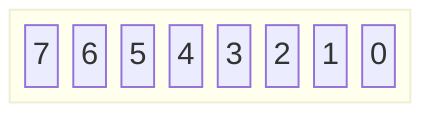

# RFC 00XX Credential Revocation

## Background
GOV.UK One Login is developing a government wallet - GOV.UK One Login digital wallet - to enable users to acquire, view and share digital versions of government-issued credentials. Over the lifetime of the credential their status may change and it is important to communicate these changes to all parties and applications involved. This document will explore the options for the keeping the Verifiable Credential status up to date. Revocation mechanisms are essential part of identity ecosystems and are required to keep the issuer, holder and verifier up to date with the credential status.

## Requirements

GOV.UK One Login or an issuer may want to revoke credential(s) they have issued.

- The revocation may be permanent or temporary depending on the scenario.
- The revocation must support at least 4 statuses, Valid, Invalid, Suspended and Application specific.
- The revocation mechanism must be secure, privacy preserving and scalable to billions of records.

Some example scenarios are 

- Revoking a driving licence as a result of disqualification.
- Issuance of a full licence to replace a provisional licence.

## Scope

This RFC builds on the [IETF Oauth Status List RFC](https://datatracker.ietf.org/doc/draft-ietf-oauth-status-list/06/) and focuses on the use of status list to provide up to date statuses for the GOV.UK One Login wallet issuer, holder and verifier.

## References to other design documents

## Options

### IETF OAuth Status List

The [IETF OAuth Status List](https://datatracker.ietf.org/doc/draft-ietf-oauth-status-list/06/) aims to provide a mechanism of communicating semantics about the token or its validity as that may change over time. It specifically calls out token formats secured by [Javascript Object Signing and Encryption](https://www.iana.org/assignments/jose/jose.xhtml) (JOSE) or CBOR Object Signing and Encryption (COSE), such as [JWTs](https://datatracker.ietf.org/doc/html/rfc7519), [SD-JWT VCs](https://datatracker.ietf.org/doc/draft-ietf-oauth-sd-jwt-vc/), [CWTs](https://datatracker.ietf.org/doc/html/rfc8392) and [ISO mdoc](https://www.iso.org/obp/ui/en/#iso:std:69084:en) that have application and relevance to GOV.UK OneLogin.

The OAuth Status List defines a data structure that describes individual statuses of multiple Referenced Tokens. The statuses of the Referenced Tokens are represented by one or multiple bits in the Status List. Each Referenced Token is allocated an index during issuance and the value of the bit(s) at the index in the Status List represents the status of Referenced Token.

- Each status of a Referenced Token MUST be represented with a bit-size of 1,2,4, or 8. Therefore up to 2,4,16, or 256 statuses for a Referenced Token are possible, depending on the bit-size.
- The overall Status List is encoded as a byte array.
- The status of each Referenced Token is identified using the index that maps to one or more specific bits within the byte array.
- The index starts counting at 0 and ends with "size"- 1.
- The bits within an array are counted from least significant bit "0" to the most significant bit ("7").

- All bits of the byte array at a particular index are set to a status value.
- The byte array is compressed using DEFLATE [RFC1951] with the ZLIB [RFC1950] data format. Implementations are RECOMMENDED to use the highest compression level available.

The following is an example of a JSON Object representing a Status List.

```json
{
  "bits": 1 /* REQUIRED. number of bits per Referenced Token */,
  "lst": "eNrbuRgAAhcBXQ" /* REQUIRED. compressed/base64url-encoded string that contains the status values  */
}
```

Below is a JWT representation of the status list above.

```json
{
    "alg": "ES256",
    "kid": "12",
    "typ": "statuslist+jwt"
  }
  .
  {
    "exp": 2291720170,
    "iat": 1686920170,
    "status_list": {
      "bits": 1,
      "lst": "eNrbuRgAAhcBXQ"
    },
    "sub": "https://example.com/statuslists/1",
    "ttl": 43200
  }
```

Following is an example for a decoded header and payload of a Referenced Token. The issuer can include the status claim in a Referenced Token to allow retrieval of the Status List.

```json
{
  "alg": "ES256",
  "kid": "11"
}
.
{
  "status": {
    "status_list": {
      "idx": 0,
      "uri": "https://example.com/statuslists/1"
    }
  }
}
```

#### Status Types

The OAuth Status List also describes the state, mode, condition or stage of each entity represented by each Referenced Token. If the list contains more than one bit per Referenced Token, for example to represent two states VALID and INVALID, then the whole combination must be used to describe one state. A Referenced Token cannot have multiple states in the Status List. The registry in Section [14.5](https://www.ietf.org/archive/id/draft-ietf-oauth-status-list-06.html#name-status-types-registry) of the OAuth Status List RFC includes the most common Status Type Values. See some values below.

* 0x00 - "VALID" - The status of the Referenced Token is valid, correct or legal.

* 0x01 - "INVALID" - The status of the Referenced Token is revoked, annulled, taken back, recalled or cancelled.

* 0x02 - "SUSPENDED" - The status of the Referenced Token is temporarily invalid, hanging, debarred from privilege.  This state is reversible.

#### Validation Rules

The processing rules for JWT or CWT precede any evaluation of a Referenced Token's status. This means if "exp" shows that the Token is expired then even a Valid Status will be considered expired.

### Pros
Compressed using DEFLATE [RFC1951] with the ZLIB [RFC1950] data format.
Allows caching of status list with ttl.
Provides examples of JWT, CWT and mdoc representations.
SD JWT references the user of status list as an option for token status updates.

### Cons
New Status Type must be registered in the [Status Types Registry](https://www.ietf.org/archive/id/draft-ietf-oauth-status-list-06.html#name-status-types-registry).

### W3C Bitstring Status List

In a [Bitstring Status List](https://www.w3.org/TR/vc-bitstring-status-list/) The status information of a verifiable credential issue by the issuer is represented as items in a list. Each issuer manages a list of all verifiable credentials that it has issued. Each verifiable credential is associated with an item in its list. When a single bit specifies a status, such as "revoked" or "suspended", then that status is expected to be true when the bit is set (1) and false when unset (0).

An individual bit represents a status when the bit is set (1) the status is true for the associated credential. When the bit is unset (0) the status is not true for the credential. A simple example below shows a StatusListCredential with bit at index `94567` representing the `revocation` status for credential at URL "https://example.com/credentials/status/3". Similarly bit at index 23452 represents the "suspension" status of the credential at URL "https://example.com/credentials/status/4".

```json
 Example StatusListCredential using simple entries
{
  "@context": [
    "https://www.w3.org/ns/credentials/v2",
    "https://www.w3.org/ns/credentials/examples/v2"
  ],
  "id": "https://example.com/credentials/23894672394",
  "type": ["VerifiableCredential", "EmployeeIdCredential"],
  "issuer": "did:example:12345",
  "validFrom": "2024-04-05T14:27:42Z",
  "credentialStatus": [{
    "id": "https://example.com/credentials/status/3#94567",
    "type": "BitstringStatusListEntry",
    "statusPurpose": "revocation",
    "statusListIndex": "94567",
    "statusListCredential": "https://example.com/credentials/status/3"
  }, {
    "id": "https://example.com/credentials/status/4#23452",
    "type": "BitstringStatusListEntry",
    "statusPurpose": "suspension",
    "statusListIndex": "23452",
    "statusListCredential": "https://example.com/credentials/status/4"
  }],
  "credentialSubject": {
    "id": "did:example:6789",
    "type": "Person",
    "employeeId": "A-123456"
  }
}
```

A slightly complex example is of an issuer committing to a set of messages associated with a credential. This is done by using "statusListIndex" and "statusSize" (in bits). A statusSize of 2 bits means we can have 4 statuses 00,01,10,11. What each of them mean is represented in "statusMessage". See example Below

```json
Example StatusListCredential using more complex entries
{
  "@context": [
    "https://www.w3.org/ns/credentials/v2",
    "https://www.w3.org/ns/credentials/examples/v2"
  ],
  "id": "https://example.com/credentials/2947478373",
  "type": ["VerifiableCredential", "BillOfLadingExampleCredential"],
  "issuer": "did:example:12345",
  "validFrom": "2024-04-05T03:52:31Z",
  "credentialStatus": {
    "id": "https://example.com/credentials/status/8#492847",
    "type": "BitstringStatusListEntry",
    "statusPurpose": "message",
    "statusListIndex": "492847",
    "statusSize": 2,
    "statusListCredential": "https://example.com/credentials/status/8",
    "statusMessage": [
        {"status":"0x0", "message":"pending_review"},
        {"status":"0x1", "message":"accepted"},
        {"status":"0x2", "message":"rejected"},
        ...
    ],
    "statusReference": "https://example.org/status-dictionary/"
  },
  "credentialSubject": {
    "id": "did:example:6789",
    "type": "BillOfLading",
    ...
  }
}
```


```json
Example BitstringStatusListCredential
{
  "@context": [
    "https://www.w3.org/ns/credentials/v2"
  ],
  "id": "https://example.com/credentials/status/3",
  "type": ["VerifiableCredential", "BitstringStatusListCredential"],
  "issuer": "did:example:12345",
  "validFrom": "2021-04-05T14:27:40Z",
  "credentialSubject": {
    "id": "https://example.com/status/3#list",
    "type": "BitstringStatusList",
    "statusPurpose": "revocation",
    "encodedList": "uH4sIAAAAAAAAA3BMQEAAADCoPVPbQwfoAAAAAAAAAAAAAAAAAAAAIC3AYbSVKsAQAAA"
  }
}
```

Pros
data compression - highly compressible using run-length compression techniques such as GZIP [RFC1952](https://www.rfc-editor.org/rfc/rfc1952).
The status list is expressed inside a verifiable credential in order to enable a holder to provide it directly to a verifier.
The standard has considerations to align implementation to OAuth Status List to allow interoperability in code.
`BitstringStatusListEntry` `statusMessage` property can be used to describe the number of statuses indicated by `statusSize` property

Cons
Bitstring Status List is a W3C Candidate Draft and is not a standard yet.
The working group might change the specification, for example `TTL` conflicts with `validUntil` and it might be removed in the future.
Using different `statusMessage` across issuers can make the implementation complex.

### Certificate Revocation Lists (CRL)
[RFC5280](https://www.rfc-editor.org/rfc/rfc5280)

### Online Certificate Status Protocol
[OCSP RFC2560](https://datatracker.ietf.org/doc/html/rfc2560)

### Token Introspection Token 
[rfc7662](https://datatracker.ietf.org/doc/html/rfc7662)

## Solution Design

### Design Considerations

The OAuth Status List and Bitstring Status List provide several security ([1](https://www.ietf.org/archive/id/draft-ietf-oauth-status-list-06.html#name-security-considerations), [2](https://www.w3.org/TR/vc-bitstring-status-list/#security-considerations)), privacy ([1](https://www.ietf.org/archive/id/draft-ietf-oauth-status-list-06.html#name-privacy-considerations), [2](https://www.w3.org/TR/vc-bitstring-status-list/#privacy-considerations)) and [implementation](https://www.ietf.org/archive/id/draft-ietf-oauth-status-list-06.html#name-implementation-consideratio) considerations. Some more are listed below.

- The status update checks must not result in tracking of the holder by the Issuer or the Verifier. 
- The solution should align to standard that will be supported by OIDC and mDl standards.

### Proposed Solution
A Status List is required to provide a efficient and performant mechanism to the issuer, holder and the verifier to ensure all parties are aware of the validity of the credentials. The Status List is a performance enhancement that means the wallet app does not have to re-fetch the credential to ensure its validity, instead it can rely on the Status List to provide that information. This means that the must keep the list up to date and reflect any changes as soon as they are available.

Form the options listed in the sections above the OAuth Status List and Bitstring Status List are the two main options being considered for creating a mechanism for credential revocation Status List. Out of the two options OAuth Status list is the preferred option for the following reasons.

- It has consistent way of storing statuses in a list, that is you have to select 1,2,4 or 8 bits and all statuses in the list must use the same number of bits.
- The [Status Types Values](https://www.ietf.org/archive/id/draft-ietf-oauth-status-list-06.html#name-status-types) are part of the specification and predefined. Additional statuses must be registered in the [registry](https://www.ietf.org/archive/id/draft-ietf-oauth-status-list-06.html#iana-status-types). This ensures all parties use same Valid, Invalid and Suspended bit combination to represent Status Type values and can use application specific statuses to meet any additional requirements. 
- It defines a mechanism, data structures and processing rules for representing the status of tokens secured by JSON Object Signing and Encryption (JOSE) or CBOR Object Signing and Encryption (COSE), such as JWT, SD-JWT VC, CBOR Web Token and ISO mdoc.
- The Reference Token Issuer (credential issuer in this case), Status Issuer and Status Provider roles can be fulfilled by different entities.
- [SD-Jwt](https://www.ietf.org/archive/id/draft-ietf-oauth-sd-jwt-vc-08.html#name-issuer-holder-verifier-mode) mentions use of a Status Provider and reference Status List  to support revocation of Verifiable Credentials.
- The new draft for ISO-compliant driving licence — Part 5: Mobile driving licence (mDL) application suggests use of Status List for revocation.

> **Note**
>
> At the time of the writing both OAuth Status List and Bitstring Status List are drafts and not standards.

#### Bits and Status Type Values
The proposed solution will use OAuth Status List with 2 bits. Initially only two Status Types will be supported.

- 0x00 - "VALID" - The status of the Referenced Token is valid, correct or legal.

- 0x01 - "INVALID" - The status of the Referenced Token is revoked, annulled, taken back, recalled or cancelled.

A Invalid token cannot be reinstated, changed back to Valid. It must stay revoked for its lifetime. Below is a example list of 8 statuses.

```
status[0] = 1
status[1] = 0
status[2] = 0
status[3] = 1
status[4] = 0
status[5] = 1
status[6] = 0
status[7] = 1
```
The byte array will be represented in the following order.

```
byte             0                  1        
bit       7 6 5 4 3 2 1 0    7 6 5 4 3 2 1 0 
         +-+-+-+-+-+-+-+-+  +-+-+-+-+-+-+-+-+
values   |0|1|0|0|0|0|0|1|  |0|1|0|0|0|1|0|0|
         +-+-+-+-+-+-+-+-+  +-+-+-+-+-+-+-+-+
          \ / \ / \ / \ /    \ / \ / \ / \ / 
status     1   0   0   1      1   0   1   0  
index      3   2   1   0      7   6   5   4  
           \___________/      \___________/  
                0x41               0x44      
```

The resulting byte array and compressed/base64url-encoded Status List is below.

```
byte_array = [0x41, 0x44]
encoded:
{
  "bits": 2,
  "lst": "eNpzdAEAAMgAhg"
}
```
Below is an example of the Status List JWT.
```
{
  "alg": "ES256",
  "kid": "12",
  "typ": "statuslist+jwt"
}
.
{
  "exp": 2291720170,
  "iat": 1686920170,
  "status_list": {
    "bits": 2,
    "lst": "eNpzdAEAAMgAhg"
  },
  "sub": "https://example.com/statuslists/1",
  "ttl": 43200
}
```
Below is an example of Referenced Token with a status claim with a status index and a URI for the Status List Token. 
```
{
  "alg": "ES256",
  "kid": "11"
}
.
{
  "status": {
    "status_list": {
      "idx": 3,
      "uri": "https://example.com/statuslists/1"
    }
  }
}
```
#### Status List Formats
The OAuth Status List RFC defines two token formats for the Status List.
- Json Web Token (JWT)
- CBOR Web Token (CWT)

Both formats will be supported for the implementation.

#### Decentralised Vs Centralised Status List
The status list can be hosted by each Issuer or Status Provider in a decentralised manner. Alternatively it can be hosted centrally both approaches have their benefits and drawbacks.

##### Decentralised
An Issuer or a Status Provider for the credentials provided by the Issuer associated with the Issuer can maintain and decentralised status list will be 
Benefit

Reduced blast radius
No inter-department replay mechanism should the service go down

Drawback
Increases the work needed to become an issuer
Each issuer needs to be competent building such resilient infrastructure
Anonymity and number of creds issued
Pre-fill random set of indexes so people can’t see the number off creds issued

##### Centralised
Benefit

- Build it once (not just prod but also test)
- One set of people becomes experts
- Less issuer work

Drawback

- Blast radius

#### Functional and Non Functional requirements

- The solution must scale out with sharded services and preserve anonymity by spreading across the shards.
- Deployment in different regions and cloud providers must be considered.

#### Interfaces

### Issuer Responsibility

### Holder Responsibility

### Verifier Responsibility

## Open Questions

- Do we need to support a refresh status for a VC? This is mentioned Bitstring List and VC data model https://www.w3.org/TR/vc-data-model-2.0/#refreshing
- What happens to credential that have been revoked permanently? Do they stay in the list forever? That will bloat the list over time. Perhaps the solution should be chunked status list with 
- Should the default value for the status list byte array be other than Zeros?